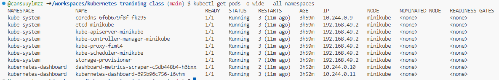

# Kubectl get pods

podların tüm namespacelerdeki listesini getirir.
```
kubectl get pods
```


bir namespace içerisindeki podların listesini getirir
```
kubectl get pods -n kube-system
```


bir namespace içerisindeki podların detaylı listesini getirir
```
kubectl get pods -o wide --all-namespaces
```



